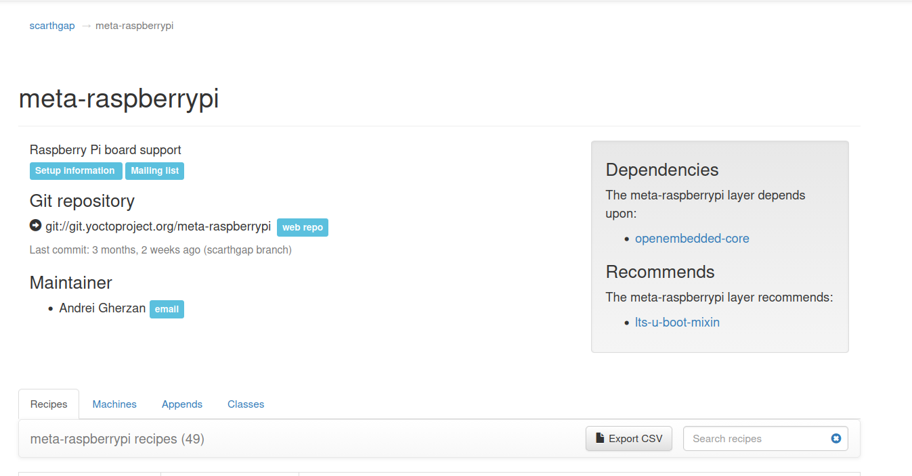
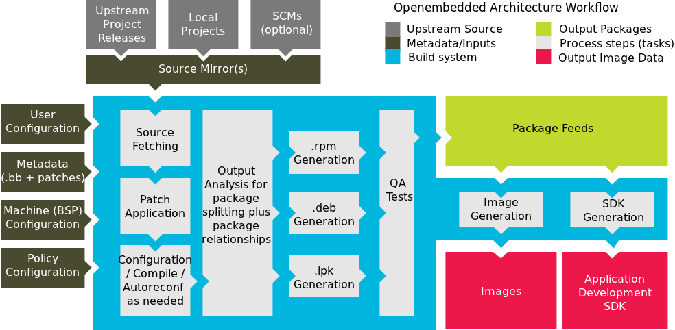

# Yocto

## Setup

- create a directory for the project called yocto
- clone the poky repo

```bash
git clone git@github.com:yoctoproject/poky.git --branch=scarthgap
```

- clone the raspberrypi layer from open embedded store


```bash
git clone git://git.yoctoproject.org/meta-raspberrypi --branch=scarthgap
```

- select the scarthgap branch on the store
- look for the dependancies to make sure
- open-emebedded-core is already included in poky repo in the meta directory so dont worry about it

## Bitbake

this is the tool that download and compile the source code.


- u edit the shi on the left
- if ur building a meta layer, u need to tell bb how to build it.

### the steps are

1. download/get the source code
1. applay the patches
1. compile the source code
1. package the compiled programs(.deb, .rpm, .ipk) for ease of sharing
1. run some tests to make sure ur following the linux standards and the software is working as expected
1. the QA tests also checks the license
1. image is generated (for production)
1. SDK (Software Development Kit) is generated
1. the package feeder is thetool that adds the compiled packages to the image

## poky

- has a script to setup the environment for bitbake called ``oe-init-build-env``
- creates a build directory where all the build files are stored

### ``bblayers.conf``

- this file is used to tell bitbake where to find the meta layers
- add the path to the meta-raspberrypi layer to the BBLAYERS variable
- u can use ``bitbake-layers`` to check if the layer is added correctly

    ```bash
    bitbake-layers show-layers # to show the layers
    bitbake-layers add-layer meta-raspberrypi # to add the layer
    bitbake-layers create-layer meta-????? # to create a new layer
    ```

### ``local.conf``

- this file is used to configure the build process
- u can set the machine you want to build for, the name is in the conf/machine directory of the meta-raspberrypi layer
- comment the line that sets the machine to qemux86-64 and sets the machine to ``raspberrypi3-64`` like this:

    ``` bash
    # MACHINE ??= "qemux86-64"
    MACHINE ??= "raspberrypi3-64"
    ```

- uncomment the line TMPDIR & SSTATE_DIR:

    ```bash
    # replace the dots with a directory where u have storage, or take it from a friend
    TMPDIR = "..................../share/tmp"
    SSTATE_DIR ?= "................./share/sstate-cache"
    DL_DIR ?= "..................../share/downloads"
    ```

- to use more threads for faster compilation, add the following lines to the local.conf file:

    ```bash
    # Number of threads to use for compilation
    BB_NUMBER_THREADS = "11"
    # Number of threads to use for parsing recipes
    PARALLEL_MAKE = "-j 11"
    ```

- to know the num of threads available on ur machine, run the following command:

    ```bash
    nproc
    ```

## build the image

- to build the image, run the following command:
- use (-K) to keep the build going even if there are errors, this is useful for debugging
- u can take the download dir and the sstate-cache dir from the build directory and share it with others

```bash
bitbake core-image-minimal -K 
```

### some errors are solved with this

- ```bash
  sudo sysctl -w kernel.apparmor_restrict_unprivileged_userns=0
  ```

-
