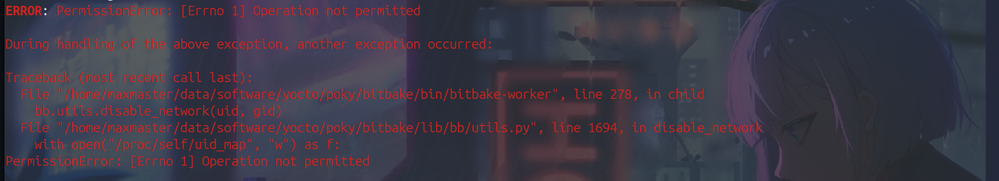

# Yocto

## How to use this repo

```bash
git clone --recurse-submodules git@github.com:PM-Maestro-ITI-GP-Org/Yocto_BMO_Image.git
```

u can force pulling the submodules by using:

```bash
git submodule sync --recursive
git submodule update --init --recursive
```

## How to build the image

```bash
cd Yocto_BMO_Image
source poky/oe-init-build-env
bitbake bmo-image-ai
```



use this command to fix the error:

```bash