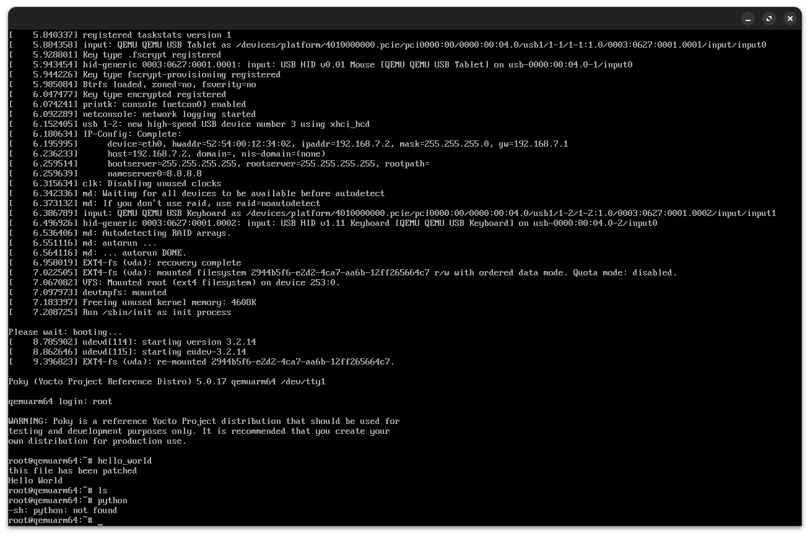

# Recipe Patching




After creating a recipe you can fix any issues with it by patching it

- creating a patch this command:

```bash
git format-patch -1 <commit-hash>
```

This will create a patch file in the current directory that you can then apply to your recipe using the following command:

```bash
git apply <patch-file>
```


- to add the binary to the image you need to add the following line to your recipe:

```yocto
do_install(){
    install -d ${D}${bindir}
    install -m 0755  ${WORKDIR}/<binary-name> ${D}${bindir}
}
```

and do this in the conf file:

```bash
IMAGE_INSTALL:append = " <binary-name>"
# the space here -------^ is important
```

